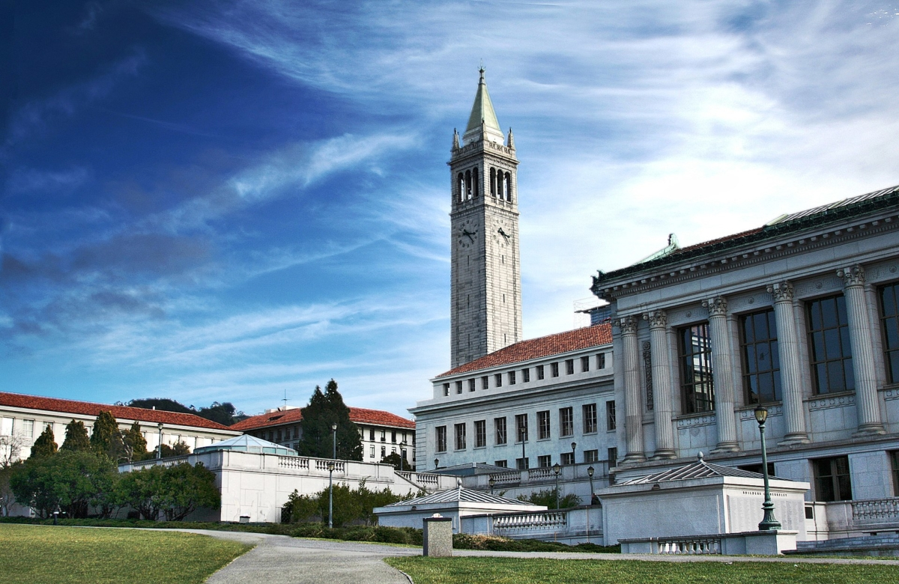

# Undergraduate

University of California Berkeley

* 2006-2010
* BA in Genetics and Economics
* Graduated with Highest Honors

# Medical School

Weill Cornell Medical College

* 2012-2016
* Graduated with Honors in Service
* Awarded the Coryell Prize in Medicine for highest achievement in Medicine

# Residency

Hospital of the University of Pennsylvania

* 2016-2019

# Cardiology Fellowship

New York Presbyterian-Columbia

* 2019-current 
