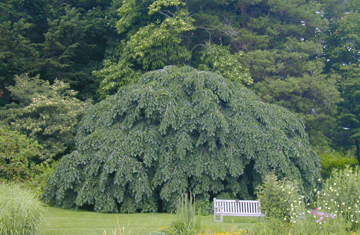

## Rock climbing

Parcent, Spain

## Traveling

Hạ Long Bay, Vietnam

Lares Trek, Peru
This trek takes you through some of the most BEAUTIFUL places in the world. My pictures do not do it justice.

## Plants/Trees

This funny looking tree is my current favorite tree, called the Camperdown Elm or Ulmus glabra. You can find several of them in Central Park. 

I became interested in tree species identification after taking this wonderful class offered in the Spring and Summer through the [Brooklyn Brainery](https://brooklynbrainery.com/courses/tree-identification-for-beginners).
