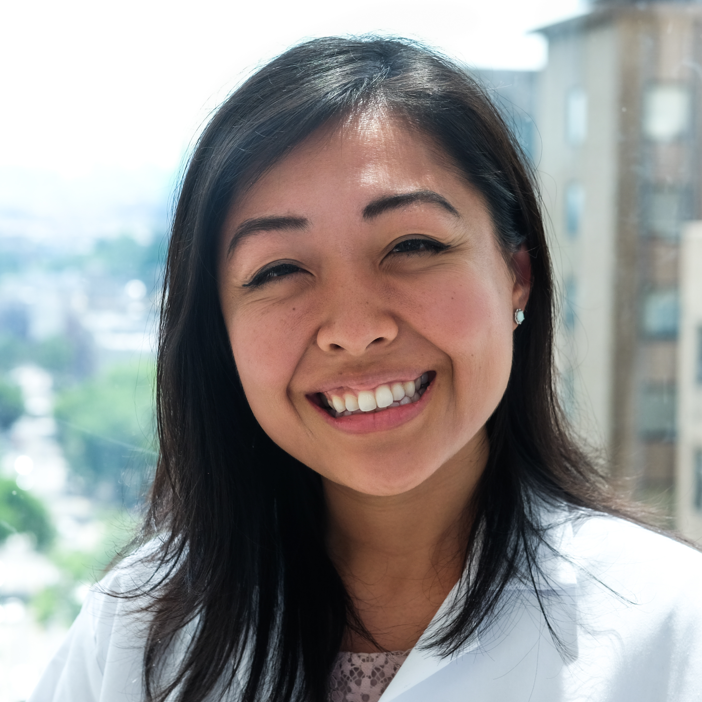

---
---

<link rel="stylesheet" href="styles.css" type="text/css">

I am a cardiology fellow at New York Presbyterian-Columbia, currently in my research year. I am interested in genetic cardiomyopathies and am working on my masters in patient oriented research, with a focus on genetics and biostatistics. 

I grew up in Southern California, by way of Nova Scotia, but have been in the East Coast for the majority of my medical training. 

I am a budding R enthusiast and am building skills in machine learning and working with big data.